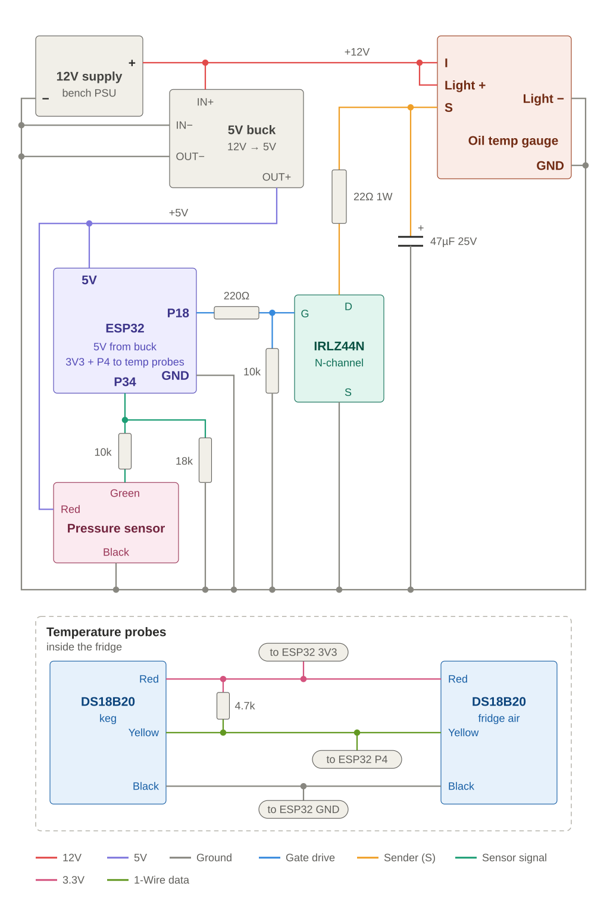
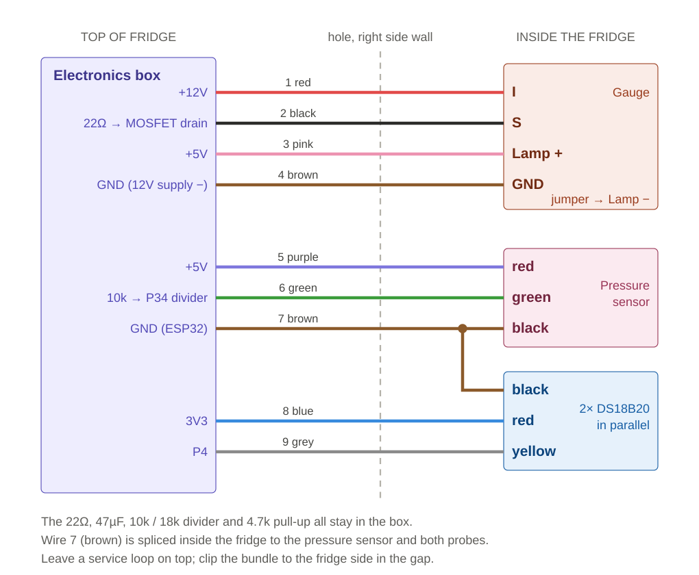

# kegerator-gauge

An ESP32 drives a real 12V automotive gauge to show **CO2 keg pressure** on a kegerator. It also
serves a phone-friendly web page with the pressure and the keg and fridge-air temperatures.

The gauge is an electronic oil-temperature gauge (terminals **S / I / GND**, dial 130–300),
mounted in the fridge door. The ESP32 fakes the gauge's temperature sender, so the needle can be
put anywhere on the dial from code.



## Status

| Part | State |
|---|---|
| Gauge driven from the ESP32 (PWM + MOSFET), dial calibrated | Done |
| 0–60 psi pressure sensor read and calibrated | Done (span to be re-done with the CO2 regulator) |
| 12V supply + 12V→5V buck converter | Done |
| Home Wi-Fi, `http://kegerator.local`, over-the-air updates | Done |
| Web display page (pressure dial, temps) + password-protected config page | Done |
| 2× DS18B20 temperature probes (keg + fridge air), assigned on the config page | Done |
| Installed in the fridge: box on top, 9-wire harness through the side wall | Done |
| Needle driven from pressure (0 psi→140, 12→210, 30→260, 60→300 on the dial) | Planned |

## Hardware

- **ESP32 dev board** (CP2102, USB-C) on a screw-terminal breakout
- **12V electronic gauge** with S / I / GND terminals, lit by a **5V LED** pinball lamp
  (BA9s base) in place of its original 12V bulb
- **IRLZ44N** logic-level N-MOSFET, **22Ω 1W**, **47µF 25V**, **220Ω**, **10k**
- **0–60 psi pressure transducer**, 5V, 0.5–4.5V output, 1/8" NPT (red +5V, black GND, green signal)
- **10k + 18k** voltage divider for the sensor signal (4.5V → ~2.9V for the ESP32)
- **2× DS18B20** waterproof probes (red 3.3V, black GND, yellow data) + one **4.7k** pull-up
- **12V 5A supply** and **12V→5V 5A buck converter**

### Pins

| Pin | Use |
|---|---|
| GPIO18 (P18) | Gauge PWM → MOSFET gate |
| GPIO34 (P34) | Pressure sensor, through the 10k/18k divider (ADC1, works with Wi-Fi on) |
| GPIO4 (P4) | DS18B20 1-Wire bus, 4.7k pull-up to 3V3 |

Avoid **GPIO12 (P12)** for anything with a pull-up. It's a boot strapping pin, and holding it
high at power-on stops the ESP32 from booting.

### How the gauge is driven

The gauge expects a thermistor between **S** and ground: lower resistance moves the needle up. A
MOSFET switches S to ground through 22Ω with 5 kHz PWM. More duty means lower average
resistance, which moves the needle up. The 47µF capacitor on S, mounted in the box next to the
MOSFET, smooths the PWM, so the wire to the gauge carries a steady current. The response is
non-linear (the top of the dial needs much more duty per degree), so a measured calibration
table (`cal[]`) maps dial values to duty.

**Never connect S directly to an ESP32 pin.** It can sit near 12V.

### Installation

The electronics box sits on **top of the fridge**. Nine stranded 16 AWG automotive wires run
down the gap on the right side and through a hole in the right side wall of the fridge section.
Inside, they go to the sensors and across the hinge gap to the gauge in the door.



| # | Color | Box end | Fridge end |
|---|---|---|---|
| 1 | Red | +12V | Gauge I |
| 2 | Black | MOSFET drain (via 22Ω) | Gauge S |
| 3 | Pink | +5V | Lamp + |
| 4 | Brown | GND (12V supply −) | Gauge GND, jumper to Lamp − |
| 5 | Purple | +5V | Pressure sensor red |
| 6 | Green | 10k (divider input) | Pressure sensor green |
| 7 | Brown | GND (ESP32) | Pressure sensor black + both probes' black |
| 8 | Blue | 3V3 | Both probes' red |
| 9 | Grey | P4 | Both probes' yellow |

- **Two grounds:** the gauge and lamp current returns on its own brown wire, so it never flows in
  the sensors' ground and shifts the pressure reading.
- **Before drilling a fridge wall,** check for refrigerant lines. Many fridges have a warm
  "hot gas" anti-condensation loop behind the front edge. This one (GE GTE17DTNDRBB, R600a
  refrigerant) has a fan-cooled condenser underneath according to its tech sheet, so the side
  walls shouldn't carry condenser tubing. The sheet doesn't show the hot gas loop's route. The hole is about halfway up the fridge section, 6" back from the front.
  Drill the outer skin, probe the foam, then drill the liner from inside. Seal both ends.
- Leave a **slack loop at the hinge** and a **service loop on top**, so the door and the fridge
  can move without pulling on the wires.

### Wiring notes

- All grounds are common: 12V supply −, buck converter, ESP32, gauge, MOSFET source and sensors.
- Divider order matters: **10k from the sensor's green wire to P34, 18k from P34 to GND**.
- Set the buck converter to 5.0V **before** connecting it.
- Don't power the ESP32 from USB and the buck converter at the same time. It isn't yet known
  whether this board isolates USB 5V from the 5V pin.
- `esp32_gauge_wiring.png` is the original proof-of-concept wiring (gauge only, USB power).
  `wiring-diagram.svg` is the current wiring.

## Software

Arduino IDE 2 with the **esp32 by Espressif** core (3.x). Board: **ESP32 Dev Module**, Partition
Scheme **Default 4MB with spiffs** (it has room for OTA).

Libraries (Library Manager): **OneWire** (Paul Stoffregen) and **DallasTemperature** (Miles
Burton). Wi-Fi, WebServer, mDNS, ArduinoOTA, HTTPUpdateServer and Preferences come with the core.

| File | What it is |
|---|---|
| `PhysicalGauge/PhysicalGauge.ino` | The sketch |
| `PhysicalGauge/web_page.h` | The web pages (display, config, Wi-Fi setup) |
| `ota-upload.bat` | Compile and upload over Wi-Fi (Windows) |
| `wiring-diagram.svg` | Circuit |
| `cable-plan.svg` | The 9-wire harness, with wire colors |

### First-time Wi-Fi setup

1. Upload once over USB.
2. With no home network saved, the ESP32 starts its own network **Kegerator-Setup**.
3. Join it from a phone and open `http://192.168.4.1/wifi`. Choose your 2.4 GHz network and
   enter its password.
4. It reboots and joins your network. Then open **http://kegerator.local**.

Home Wi-Fi credentials are stored in the ESP32's flash, **never in the source code**. If the
home network is unreachable for 20 seconds, the setup network comes back on. The gauge keeps
working without Wi-Fi.

### Web pages

| Page | Access | Contents |
|---|---|---|
| `/` | Open | CO2 pressure dial (0–60 psi, green 10–14 psi serving band), keg + air temps |
| `/config` | Login | Live sensor readings, zero / span calibration, probe assignment, system info |
| `/wifi` | Login | Change the home network |
| `/update` | Login | Upload a firmware `.bin` |
| `/data` | Open | All live values as JSON (internal, changes with the web pages) |
| `/api` | Open | Stable JSON for other programs (see below) |

The login is user `OTA_USER` with password `OTA_PASS`, both set near the top of the sketch.

### API

`GET http://kegerator.local/api` returns:

```json
{"psi":12.34,"kegF":37.0,"airF":38.0}
```

Any value is `null` when there's no valid reading (sensor fault, probe unassigned or offline).
Pressure is smoothed over about half a second. Temperatures update every 2 seconds.

### Updating over Wi-Fi (OTA)

Double-click **`ota-upload.bat`**. It compiles the sketch, then uploads it with `espota` straight
to the IP address in the batch file. If that fails, it posts the `.bin` to the board's `/update`
page instead. Set `ESP32_IP` and `OTA_PASS` at the top of the batch file.

The Arduino IDE's "Network ports" menu may not list the board on PCs with extra virtual network
adapters. The batch file avoids that by going straight to the IP address.

### Pressure calibration

Do this on the final power supply, because the sensor's output follows its 5V supply.

1. **Zero:** sensor open to air → **Set zero** on `/config` (or `z` in Serial Monitor).
2. **Span:** apply a known pressure, enter the reference gauge's reading → **Set span** (or `k30`).

Both are saved in flash and survive reboots and updates. Readings far outside the sensor's
spec are rejected, so a wiring fault can't be saved as a calibration.

### Temperature probes

Both DS18B20s share one 1-Wire bus. Each probe has a unique 64-bit ID, so they're told apart
by ID, not by wiring. On `/config`, hold one probe in your hand. The reading that rises is
that probe. Click **Keg** or **Air** for it. Assignments are saved in flash by probe ID.

Readings are taken every 2 seconds in the background. Error values (−127 no answer, 85°C
power-on) are discarded. If a probe is missing, the bus is searched again every 30 seconds,
so a probe that's reconnected shows up without a reboot.

### Serial commands (115200 baud, Newline)

| Command | Action |
|---|---|
| `180` | Put the needle on 180 (dial units, from `cal[]`) |
| `d512` | Raw PWM duty 0–1023 (for dial calibration) |
| `s` / `w` | Fast sweep / slow calibration sweep (Enter stops it) |
| `p` | Toggle live pressure readout |
| `z` / `k30` / `r` | Zero / span at 30 psi / clear saved pressure calibration |
| `t` | Temperature probes: IDs, readings, keg / air assignment |
| `wifi` / `wififorget` | Wi-Fi status / erase saved network and reboot |
| `?` | Current state and calibration |
